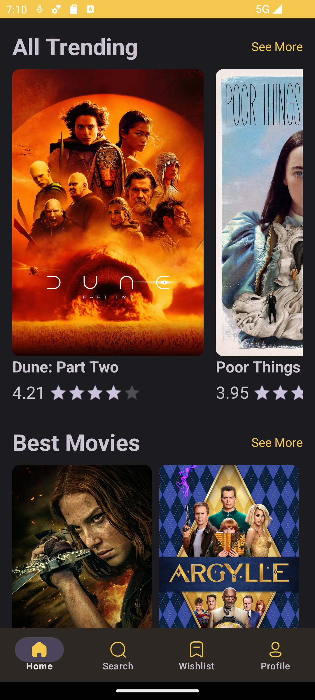
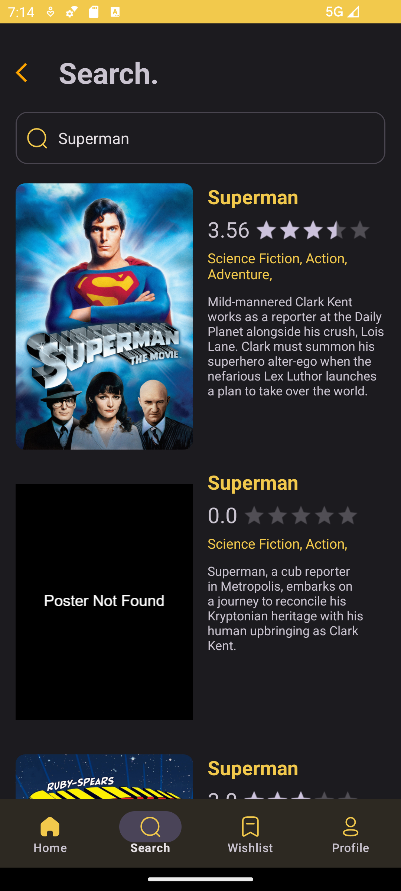
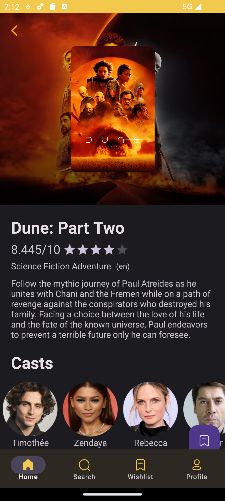
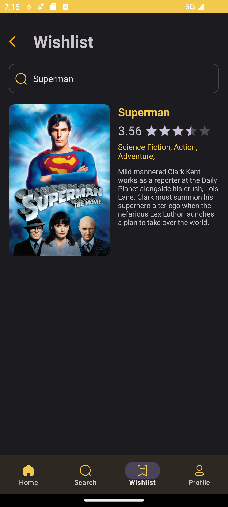

# MoviesVerse

MoviesVerse is your go-to Android app for discovering new movies, TV shows, and more. It leverages the power of Kotlin, Retrofit, Gson, OkHttp, and Hilt to provide a seamless and enjoyable experience for users.

## Features

- **Discover New Content:** Explore a vast library of movies and TV shows to find your next favorite entertainment.
- **Search Functionality:** Easily search for specific movies or TV shows based on your preferences.
- **User-Friendly Interface:** Enjoy a clean and intuitive user interface designed for a smooth navigation experience.

## Technologies Used

- **Kotlin:** The programming language that powers the core functionality of MoviesVerse.
- **Retrofit:** A powerful HTTP client for making API calls and handling network requests.
- **Gson:** A library for converting JSON to Kotlin objects, simplifying data parsing.
- **OkHttp:** An HTTP client for making network requests, enhancing the overall performance of the app.
- **Hilt:** A dependency injection library for Android that simplifies the process of managing dependencies.

## Screenshots

* Discover Movies and Tv Shows Section: 
* Search Functionality: 
* Show Details Section: 
* Add Movies to watch later on Wishlist: 

## Installation

1. Clone the repository:

```bash
git clone https://github.com/syedahmad-1/MoviesVerse.git
```
## Permissions
On Android versions prior to Android 6.0, wallabag requires the following permissions:

-Full Network Access.
-View Network Connections.
-Run at startup.
-Read and write access to external storage.
-The "Run at startup" permission is only used if Auto-Sync feature is enabled and is not utilised otherwise. The network access permissions are made use of for downloading content. The external storage permission is used to cache article images for viewing offline

## Usage
-Launch the MoviesVerse app on your device.

-Explore the various sections to discover new movies and TV shows.

-Use the search functionality to find specific content.
